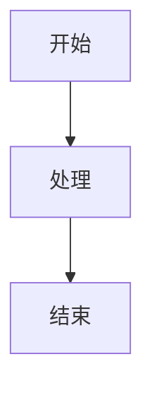

# Vue-Chato-Renderer 插件

## 简介

Vue-Chato-Renderer 是一个功能强大的 Vue 插件，提供统一的 Markdown 渲染功能，支持代码高亮、代码复制、数学公式和 Mermaid 图表等高级特性。

## 特性

- ✅ 基础 Markdown 语法支持 (GFM)
- ✅ 代码高亮 (支持多种编程语言)
- ✅ 代码复制功能
- ✅ 数学公式支持 (KaTeX)
- ✅ Mermaid 图表支持
- ✅ AST 解析和增量渲染
- ✅ 响应式设计
- ✅ 自定义配置选项

## 目录结构

```
vue-chato-renderer/
├── VueChatoRenderer.vue       # 主组件
├── components/
│   └── CodeBlock.vue          # 代码块组件
├── core/
│   ├── ast-parser.js          # AST 解析器
│   ├── markdown-renderer.js   # Markdown 渲染器
│   ├── structure-analyzer.js  # 结构分析器
│   └── vnode-transformer.js   # VNode 转换器
├── extensions/
│   ├── code-highlighter.js    # 代码高亮扩展
│   ├── copy-feature.js        # 复制功能扩展
│   ├── math-formula.js        # 数学公式扩展
│   └── mermaid-renderer.js    # Mermaid 渲染扩展
├── styles/
│   ├── code-block-styles.css  # 代码块样式
│   ├── markdown-styles.css    # Markdown 样式
│   └── variables.css          # 样式变量
├── utils/
│   ├── dom-utils.js           # DOM 工具函数
│   └── svg-utils.js           # SVG 工具函数
└── index.js                   # 插件入口
```

### 直接引入

```html
<script src="path/to/vue-chato-renderer.js"></script>
```

## 使用方法

### 1. 全局注册

```javascript
import { createApp } from 'vue'
import App from './App.vue'
import VueChatoRenderer from './plugins/vue-chato-renderer'

const app = createApp(App)

// 全局注册插件
app.use(VueChatoRenderer, {
  breaks: true,           // 自动换行
  gfm: true,              // GitHub Flavored Markdown
  highlight: true,        // 代码高亮
  copy: true,             // 复制功能
  enableAst: true         // AST 解析
})

app.mount('#app')
```

### 2. 组件中使用

```vue
<template>
  <VueChatoRenderer 
    :content="markdownContent" 
    :config="renderConfig"
  />
</template>

<script>
import { ref } from 'vue'

export default {
  setup() {
    const markdownContent = ref(`# 标题

这是一个 **Markdown** 示例

\`\`\`javascript
console.log('Hello, Vue-Chato-Renderer!')
\`\`\`

- 列表项 1
- 列表项 2

> 引用内容

| 表头 1 | 表头 2 |
|--------|--------|
| 单元格 1 | 单元格 2 |

$$ E = mc^2 $$


    `)

    const renderConfig = ref({
      breaks: true,
      gfm: true,
      highlight: true,
      copy: true,
      enableAst: true
    })

    return {
      markdownContent,
      renderConfig
    }
  }
}
</script>
```

### 3. 作为工具使用

```javascript
import { createMarkdownRenderer } from './plugins/vue-chato-renderer/core/markdown-renderer.js'

// 创建渲染器实例
const renderer = createMarkdownRenderer({
  breaks: true,
  gfm: true,
  highlight: true
})

// 渲染 Markdown
const html = renderer.render('# Hello World')
console.log(html)
```

## 配置选项

| 选项 | 类型 | 默认值 | 描述 |
|------|------|--------|------|
| `breaks` | Boolean | `true` | 是否将换行符转换为 `<br>` |
| `gfm` | Boolean | `true` | 是否启用 GitHub Flavored Markdown |
| `highlight` | Boolean | `true` | 是否启用代码高亮 |
| `copy` | Boolean | `true` | 是否启用代码复制功能 |
| `enableAst` | Boolean | `true` | 是否启用 AST 解析 |

## 支持的功能

### 1. 基础 Markdown

- 标题 (`#`, `##`, etc.)
- 粗体和斜体 (`**`, `*`)
- 列表 (有序和无序)
- 任务列表 (`- [x]`)
- 引用 (`>`)
- 链接 (`[text](url)`)
- 图片 (``)
- 水平线 (`---`)
- 表格
- 代码块 (``` 语言)

### 2. 代码高亮

支持的编程语言包括：
- JavaScript/TypeScript
- HTML/CSS
- Python
- Java
- C/C++
- Go
- Rust
- Ruby
- PHP
- SQL
- 等等（共支持 40+ 种语言）

### 3. 数学公式

使用 KaTeX 渲染数学公式：

- 行内公式：`$E = mc^2$`
- 块级公式：`$$E = mc^2$$`

### 4. Mermaid 图表

支持 Mermaid 图表语法：


## 性能优化

1. **增量解析**：当内容变化时，只解析新增部分，提高渲染速度
2. **缓存机制**：缓存 AST 和 VNode，避免重复解析
3. **按需加载**：代码高亮语言按需加载，减少初始加载时间
4. **异步处理**：复杂操作如代码高亮使用异步处理，不阻塞主线程

## 浏览器兼容性

- Chrome (最新版本)
- Firefox (最新版本)
- Safari (最新版本)
- Edge (最新版本)

## 开发指南

### 核心模块

1. **markdown-renderer.js**：负责基础 Markdown 解析和渲染
2. **ast-parser.js**：将 Markdown 解析为 AST 结构，支持增量解析
3. **vnode-transformer.js**：将 AST 转换为 Vue VNode，支持自定义渲染规则
4. **structure-analyzer.js**：分析 Markdown 结构，用于增量渲染

### 扩展模块

1. **code-highlighter.js**：代码高亮功能
2. **copy-feature.js**：代码复制功能
3. **math-formula.js**：数学公式渲染
4. **mermaid-renderer.js**：Mermaid 图表渲染

### 组件

1. **VueChatoRenderer.vue**：主渲染组件
2. **CodeBlock.vue**：代码块组件，支持高亮和复制功能

## 贡献

欢迎提交 Issue 和 Pull Request！

## 许可证

MIT License

## 更新日志

### v1.0.0
- 初始版本
- 支持基础 Markdown 渲染
- 支持代码高亮和复制功能
- 支持数学公式和 Mermaid 图表
- 支持 AST 解析和增量渲染

### v1.0.1
- 修复代码高亮按需加载问题
- 优化数学公式渲染
- 改进错误处理

## 联系方式

- 作者：Chato Team
- 邮箱：contact@chato.dev
- 官网：https://chato.dev
